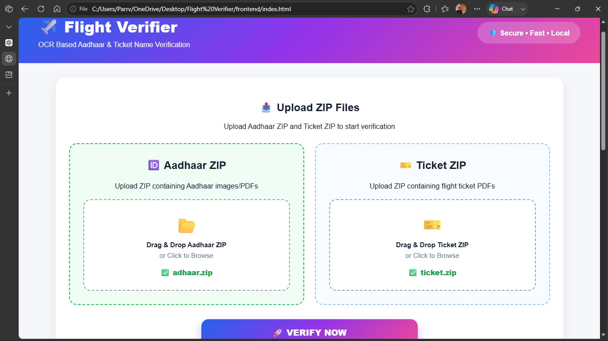

# ✈️ Flight Ticket & Aadhaar Verifier

A web-based verification system built for travel companies to simplify flight ticket and Aadhaar verification.

## 🚀 Features
- Flight ticket verification
- Aadhaar information verification
- Automatic verification report generation
- Simple and user-friendly interface

## 🛠️ Tech Stack
- Python
- HTML
- OCR
- Excel Report Generation

## 📂 Project Structure
```
backend/
 ├── main.py
 └── verification_report.xlsx

frontend/
 └── index.html
```

## 💡 Purpose
This project helps travel agencies reduce manual verification work by automatically checking ticket and Aadhaar details and generating reports.
---

# 📸 Project Screenshots

## 🏠 Home Page



---

## ✅ Verification Summary


---

## 📊 Generated Excel Report


## 👨‍💻 Developer
**Parrv Chhibber**

BCA (AI & Data Science)

JECRC University
